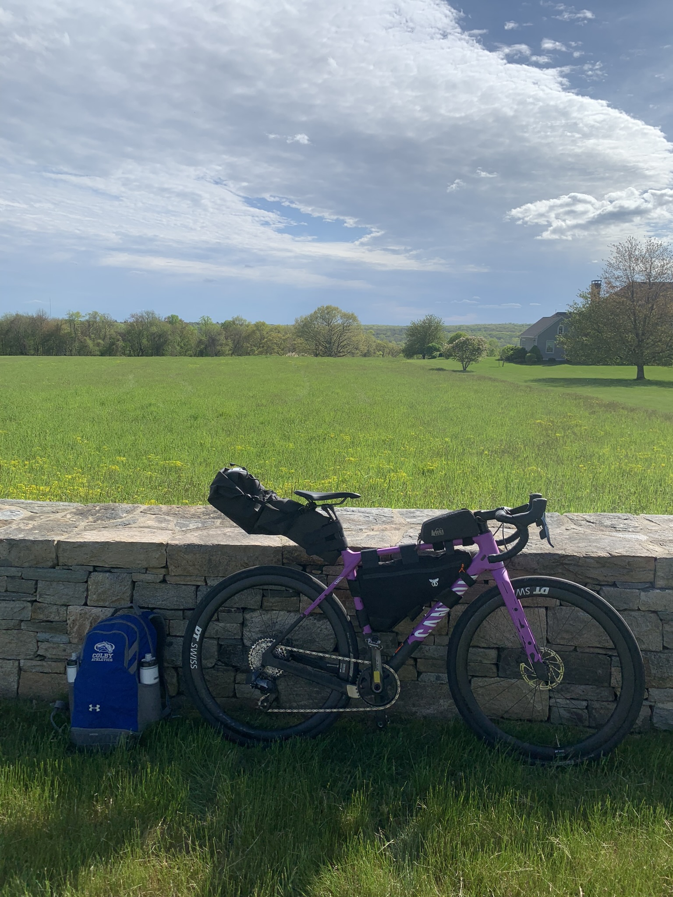

It was one of those summer days. The beach murmurs accompanied the melodic jangle of the ice cream truck. One of the days I would think about in Ms. Pierce's class while I fidgeted by fwopping my blue laminate multiplication table back and forth. She'd patiently tell me to put it down but I knew that the fwops wore on her because at the end of the year, she retired and moved to Japan.

And there I was, playing wide receiver in a two versus two game of football with three boys I had never met. I had a way of seeing a ball tossed, batted, or kicked and going to the recipient to ask, "Can I play?". In this case it was a Vortex football whose shrill whistle played a whole scale as you threw it, adding to the summer symphony.

"Sure" they would say. And I would spend the next hour proving without a shred of doubt that their gamble on me was worth it. So at fourth and a mile with the game and my reputation on the line, the Vortex twirled through the air, shrieking, sure to clear my head by twenty feet, until I jump and miraculously cradle the nose in my right fingertips, before crashing down to Earth, dragging one foot on the sand bordering the Marram grass.

I hold the Vortex up and yell "I got it!" and my teammate sprints towards me. I feel a dull pain in the bottom of my left foot, and I see the sand sticks when I lift it up. Then just beyond I see the label-less broken beer bottle. And I lose all faculty. My teammate carries my torso and the other two grab a leg each, back to the main part of the beach, where they unload me, now hysterical, into my dad's arms, his white shirt stained red when he makes the catch.

